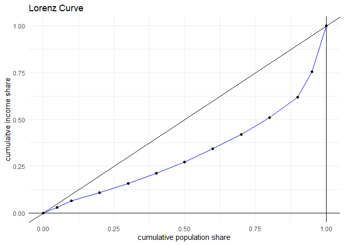

<!-- README.md is generated from README.Rmd. Please edit that file -->

# ineq

<!-- badges: start -->
<!-- badges: end -->

The goal of `ineq` is to create a set of functions to compute various
measures of economic inequality. You provide the data, choose the
relevant function and the package will compute the measures.

## Basic Measures of Economic Inequality

The three main measures of inequality that is created by this package
are the Lorenz curve, the coefficient of variation (CV) and the Gini
coefficient (Gini).

Consider a society with $j = 1, 2, \ldots, m$ income groups,

- where $y_j$ is the mean income level in group $j$,
- the groups are arranged in increasing order of mean income, i.e.,
  $y_1 \leq y_2, \ldots, \leq y_m$, and
- the number of persons in the groups are given by
  $n_1 \leq n_2, \ldots, \leq n_m$.

Note that the total number of persons in this society is given by
$$n = n_1 + n_2 + \cdots + n_m$$ and the total income level in this
society is given by $$y = n_1y_1 + n_2 y_2 + \cdots + n_my_m$$

### Lorenz Curve

The most important measure of inequality is the Lorenz curve, which is a
plot of the cumulative income share against the cumulative population
share. To construct this plot, we first create a table of the two
variables, the cumulative income share and the cumulative population
share.

Let $w_j = n_j/n$ denote the population share and $s_j=n_jy_j/y$ denote
the income share of the $j$-th group. Then the cumulative population
share is given by $cw_j = \sum_{i=1}^{j}w_i$ and the cumulative income
share is given by $cs_j = \sum_{i=1}^{j}s_i$. Now consider the plane
where $cw$ is measured on the horizontal axis and $cs$ is measured on
the vertical axis. A line plot of $cs$ against $cw$ is called the
*Lorenz curve*.

Since both $cs$ and $cw$ lies between $0$ and $1$, the Lorenz curve fits
within a square whose side is of length $1$ (or 100, if the shares are
measured in percentages). If the income distribution is perfectly equal,
then each group’s income share is the same. In that case, the Lorenz
curve is the $45$-degree line through the origin. As distributions of
income become more unequal, the Lorenz curve bows out and away from the
$45$-degree line.

### Coefficient of Variation

The mean income level is given by $$
\mu = \frac{1}{n} \sum_{j=1}^{m} n_j y_j = \sum_{j=1}^{m} w_j y_j 
$$ and the variance of the income level is given by $$
\sigma^2 = \frac{1}{n} \sum_{j=1}^{m} n_j \left(y_j-\mu \right)^2 = \sum_{j=1}^{m} w_j \left(y_j-\mu \right)^2.
$$

The second measure of inequality is the coefficient of variation:
$$CV=\sigma/\mu$$.

### Gini coefficient

The third measure of inequality is the Gini coefficient: $$
G = \frac{1}{2n^2 \mu} \sum_{j=1}^{m} \sum_{k=1}^{m} n_j n_k |y_j-y_k| = \frac{1}{2 \mu} \sum_{j=1}^{m} \sum_{k=1}^{m} w_j w_k |y_j-y_k|.
$$

### Using data on population and income shares

In many situations, researchers have access *solely* to data on
population shares and income shares of each group, i.e. $w_j$ and $s_j$,
for $j=1,2, \ldots, m$, but they do not have access to data on mean
income levels in each group. For example, a researcher might only know
the income shares of each quintile of the income distribution. How do we
compute the measures of economic inequality in this case?

The Lorenz curve requires data on cumulative population and income
shares. Using $w_j$ and $s_j$, we can construct these cumulative shares
and construct the Lorenz curve.

The CV and Gini coefficient can also be expressed in terms of population
and income shares. To see this, note that since
$s_j=n_jy_j/y=n_jy_j/n\mu=w_jy_j/\mu$, we get $y_j=(s_j/w_j)\mu$.

Using this, we see that the variance of the income distribution is given
by
$$\sigma^2 = \sum_{j=1}^{m} w_j \left(y_j-\mu \right)^2 = \sum_{j=1}^{m} \mu^2 w_j \left(\frac{s_j}{w_j}-1 \right)^2 = \mu^2 \sum_{j=1}^{m}  w_j \left(\frac{s_j}{w_j}-1 \right)^2.$$
Hence, the coefficient is variation is given by
$$CV=\frac{\sigma}{\mu}=\sum_{j=1}^{m}  w_j \left(\frac{s_j}{w_j}-1 \right)^2$$

In a similar way, using $y_j=(s_j/w_j)\mu$, we see that the Gini
coefficient is given by
$$G = \frac{1}{2n^2 \mu} \sum_{j=1}^{m} \sum_{k=1}^{m} n_j n_k |y_j-y_k| = \frac{1}{2 \mu} \sum_{j=1}^{m} \sum_{k=1}^{m} w_j w_k |(s_j/w_j)-(s_k/w_k)|$$

## Installation

You can install the development version of ineq from
[GitHub](https://github.com/) with:

``` r
# install.packages("pak")
pak::pak("dbasu-umass/ineq")
```

## Example

Let us work through an example to illustrate the functions in this
package. The following data on the distribution of consumption
expenditure in rural India in 2011 is taken from NSS KI 68/1.0 (Key
Indicators of Household Consumer Expenditure in India, June 2013).

``` r
library(ineq)

# population fractile
w2011r <- c(0.05,0.05,rep(0.1,8),0.05,0.05)

## mean consumption expenditure by fractile
y2011r <- c(521.44,665.84,783.24,904.57,1017.80,
            1135.97,1266.08,1426.76,1645.36,2007.46,
            2556.33,4481.18)

# compute measure of inequality
myresults <- ineq1(y=y2011r, w=w2011r)
```

Now, let us look at the results.

``` r
# Coefficient of variation
myresults$CV
#> [1] 0.5995949
```

``` r

# Gini coefficient
myresults$Gini
#> [1] 0.283041
```

``` r

# cumulative population and income share
myresults$lzdata
#>    cum_popsh  cum_incsh
#> 1       0.05 0.02832061
#> 2       0.10 0.06448393
#> 3       0.20 0.10702351
#> 4       0.30 0.15615280
#> 5       0.40 0.21143187
#> 6       0.50 0.27312904
#> 7       0.60 0.34189277
#> 8       0.70 0.41938341
#> 9       0.80 0.50874673
#> 10      0.90 0.61777653
#> 11      0.95 0.75661673
#> 12      1.00 1.00000000
```

The Lorenz curve.

