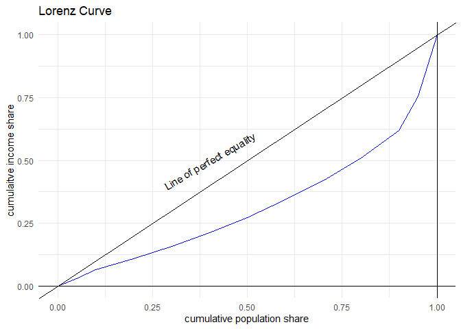

<!-- README.md is generated from README.Rmd. Please edit that file -->

# ineq

<!-- badges: start -->
<!-- badges: end -->

The goal of ineq is to create a set of functions to compute various
measures of economic inequality. You provide the data and choose the
function. ‘ineq’ computes the measures.

## Installation

You can install the development version of ineq from
[GitHub](https://github.com/) with:

``` r
# install.packages("pak")
pak::pak("dbasu-umass/ineq")
```

## Example

This is a basic example which shows you how to solve a common problem:

``` r
library(ineq)
## basic example code

y2011r <- c(521.44,665.84,783.24,904.57,1017.80,
            1135.97,1266.08,1426.76,1645.36,2007.46,
            2556.33,4481.18)

w2011r <- c(0.05,0.05,rep(0.1,8),0.05,0.05)

myresults <- ineq1(y=y2011r, w=w2011r)
```

What is special about using `README.Rmd` instead of just `README.md`?
You can include R chunks like so:

``` r
# Coefficient of variation
myresults$CV
#> [1] 0.5995949
```

``` r

# Gini coefficient
myresults$Gini
#> [1] 0.283041
```

You’ll still need to render `README.Rmd` regularly, to keep `README.md`
up-to-date. `devtools::build_readme()` is handy for this.

You can also embed plots, for example:



In that case, don’t forget to commit and push the resulting figure
files, so they display on GitHub and CRAN.
